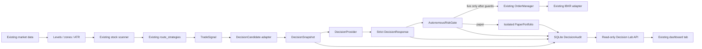

# Autonomous LLM Gerchik Agent Architecture

## Scope and safety boundary

The autonomous layer is an additive decision component inside the existing
trading process. It does not replace the market-data, levels, ATR, strategy,
signal, sizing, risk, broker, exchange, or protective-management modules.

The default is `LLM_AGENT_MODE=off`. In that mode the scanner follows the
existing path and does not create the Decision Lab database, paper portfolio,
or provider client. No mode enables live execution by itself. `live_autonomous`
requires all of the following at startup:

- `ALLOW_LLM_LIVE_TRADING=true`;
- `PAPER_TRADING=false`;
- `DRY_RUN_MODE=false`;
- a non-empty `LLM_LIVE_ACCOUNT_ALLOWLIST` containing the selected account;
- a configured model and provider;
- an existing `OrderManager` execution adapter.

The provider never receives a broker, exchange, account credential, account
number, or order API. It receives a sanitized, bounded decision snapshot and
returns one action from a server-side menu. It cannot choose quantity, entry,
stop, target, price, order type, account, or execution venue.

## Modes

| Mode | Existing deterministic scan | LLM call | Can affect existing trades | Portfolio |
|---|---:|---:|---:|---|
| `off` | Yes | No | No | None |
| `shadow` | Yes | Yes | No | None |
| `paper_autonomous` | Entry candidate is handed to the agent | Yes | No | Isolated `LLM_AGENT` JSON ledger |
| `live_autonomous` | Entry candidate is handed to the agent | Yes | Only after every hard gate | Existing `OrderManager` only |

Shadow mode is asynchronous and the existing deterministic execution path
continues unchanged. Paper mode never calls IBKR or crypto execution. Live mode
is deliberately difficult to enable and still cannot bypass the existing
`OrderManager` validator or broker adapter.

## Runtime architecture



The stock integration seam is in `src/jobs/session_utils.py::run_entry_scan`,
after `route_strategies()` has produced a fully calculated `TradeSignal` and
after the existing ATR/travel filters. `off` and `shadow` preserve the legacy
execution call; paper and live modes make the agent decision the next gate.

## Decision contracts

`src/decision/models.py` contains the serializable contracts:

- `DecisionCandidate`: existing calculated trade intent, including symbol,
  strategy, direction, level, entry, stop, target, ATR, reward/risk, and source
  identifiers. It never calculates those values.
- `DecisionSnapshot`: compact candidate plus session, price/freshness,
  position-count, open-risk, daily P&L, and sanitized market context.
- `DecisionRequest`: agent identity, mode, provider/model, snapshot, and the
  allowed action menu.
- `DecisionResponse`: strict action, confidence, ranked actions, reason codes,
  and a short summary. Unknown actions, malformed JSON, non-finite numbers,
  and overlong summaries are rejected.

Entry actions are `ENTER`, `WAIT`, and `REJECT`. Optional paper position review
uses a separate menu: `HOLD`, `TRIM_50`, `CLOSE`, and
`MOVE_STOP_TO_BREAKEVEN`.

Candidate IDs are deterministic hashes of the asset class, symbol, strategy,
direction, level/plan values, and stable setup provenance. The scan adapter
uses the completed source-bar timestamp when strategy constructors do not
provide one. If neither a timestamp nor another stable source identity exists,
the candidate is marked `identity_status=unstable`: Shadow may log it, while
Paper/Live refuse autonomous execution.

## Provider boundary

`src/decision/provider.py` implements a single `DecisionProvider` protocol and
an HTTP implementation for:

- local OpenAI-compatible endpoints (`local_openai`);
- OpenAI-compatible OpenAI and DeepSeek endpoints;
- Anthropic `/messages`.

All providers use temperature zero, bounded tokens, strict JSON extraction, and
the same system prompt. Provider failures become `provider_error` and the
agent returns `NO_ACTION`; there is no silent provider failover. API keys are
held only in process configuration and are never placed in request snapshots or
audit payloads.

When `LLM_MULTI_PROVIDER_SHADOW=true`,
`MultiProviderShadowRunner` sends the same immutable snapshot to the configured
provider set. Each result receives its own decision ID and audit row. The
runner has no execution dependency and records provider health independently.

## Deterministic risk gate

`src/decision/policy.py::AutonomousRiskGate` is mandatory for autonomous entry.
It reuses the existing position-sizing and validator functions rather than
creating a second sizing formula. It rejects stale data, excessive entry chase,
bad spread, invalid session/account state, insufficient ATR room, invalid
reward/risk, duplicate ownership, maximum open positions, available-cash/notional
violations, excessive open risk, and configured daily loss limits. News is not
an autonomous dependency unless `LLM_AGENT_USE_NEWS=true`; legacy News gates
remain in the legacy candidate/order path.

The provider's `ENTER` action is therefore only a proposal. Approval sequence:

```mermaid
sequenceDiagram
    participant S as Strategy
    participant A as Agent
    participant L as Provider
    participant R as Risk gate
    participant E as Execution
    participant D as Audit DB
    S->>A: TradeSignal -> DecisionCandidate
    A->>D: Pre-action snapshot
    A->>L: Sanitized DecisionRequest
    L-->>A: ENTER / WAIT / REJECT
    A->>D: Model decision + provider health
    alt ENTER in paper/live mode
        A->>R: Candidate + runtime context
        R-->>A: approved quantity or hard veto
        A->>D: Risk decision before execution
        alt isolated paper
            A->>A: Fill PaperPortfolio
        else explicitly guarded live
            A->>E: Existing OrderManager only
        end
        A->>D: Execution link
    else WAIT / REJECT / provider failure
        A->>D: No execution; reason code
    end
```

The risk gate is fail-closed. A missing audit write is an `audit_error` and
prevents the provider/execution sequence. A missing provider, invalid response,
or insufficient context is `NO_ACTION`.

## Protective position management

LLM reasoning is not required for protective behavior. The isolated
`PaperPortfolio` stores the deterministic stop and target and exposes
`enforce_protection()`, which closes positions when a quote crosses either
boundary. `MOVE_STOP_TO_BREAKEVEN` is allowed only when the deterministic
position gate confirms that price has moved favorably and the new stop tightens
risk. A model cannot widen, remove, or invent a stop.

The existing broker-side bracket/position-management path remains authoritative
for existing stock positions. The optional `position_review_enabled` feature is
restricted to `paper_autonomous` and only accepts positions marked
`owner=LLM_AGENT`.

## Isolated paper ownership and recovery

Paper autonomous state is stored beside the decision database in
`memory/decision_lab_portfolio.json`. It contains an explicit `LLM_AGENT`
ownership marker, cash/equity, realized and unrealized P&L, R values, open
positions, and closed positions. Writes use a temporary file, flush/fsync, and
atomic replace. Startup reloads and validates the ownership marker; unreadable
or foreign state fails closed.

The portfolio has no reference to `IBKRClient`, crypto credentials, broker
positions, or existing paper-account state. It is an experiment ledger, not a
mirror of the broker account.

## Audit database

`DecisionAudit` creates `memory/decision_lab.db` only when the agent is enabled.
The schema contains:

- `agent_runs`;
- `candidates`;
- `decision_snapshots`;
- `model_decisions`;
- `risk_decisions`;
- `execution_links`;
- `position_events`;
- `outcomes`;
- `provider_health`.

The snapshot is written before provider action. Model result, risk result, and
execution link are separate rows, which preserves the distinction:

```text
SIGNAL != DECISION != RISK != EXECUTION != OUTCOME
```

Audit query helpers expose decisions, status, performance, and provider health;
they redact sensitive context before persistence.

## Dashboard API and tab

The existing `dashboard_react/server.py` exposes read-only GET routes:

| Endpoint | Purpose |
|---|---|
| `/api/decision-lab/status` | mode, counts, model/provider label, isolated-paper summary |
| `/api/decision-lab/decisions` | recent decisions with optional symbol/action/provider/mode filters |
| `/api/decision-lab/positions` | agent-owned isolated-paper positions |
| `/api/decision-lab/performance` | persisted outcome totals, P&L, and R |
| `/api/decision-lab/providers` | provider health observations |

The Decision Lab dashboard tab is read-only. It has no mode switch, order
button, account selector, credential field, or live-control endpoint. An absent
database is displayed as an empty/off state rather than being created by a page
load.

## Crypto contract and execution separation

`mapping_to_candidate()` adapts already calculated crypto dictionaries to the
same candidate/snapshot/decision contracts. It does not route crypto plans into
the stock `OrderManager`. Crypto execution remains in the existing crypto
adapter and is not enabled by this stock autonomous integration. A future
crypto autonomous mode must provide its own deterministic crypto risk gate,
paper ledger, exchange ownership marker, and execution adapter while reusing
the contract/audit concepts.

## Failure behavior

| Failure | Behavior |
|---|---|
| Agent mode off | Existing deterministic path; no LLM state created |
| Provider timeout/HTTP error/invalid JSON | Audit provider error; `NO_ACTION` |
| Missing/stale/ambiguous context | Risk veto or `NO_ACTION` |
| Snapshot/audit DB write failure | Stop before provider/execution (`audit_error`) |
| Duplicate autonomous candidate | Idempotent skip when an active execution exists |
| Paper state ownership/read failure | Fail closed; no paper execution |
| Live permission/account/paper/dry-run mismatch | Startup veto |
| Protective stop/target crossed | Deterministic portfolio action; no LLM call |
| Broker/exchange behavior | Remains owned by existing adapter; no direct provider access |

## Validation checklist

The implementation should be promoted through these evidence levels:

1. Contract/provider/audit/policy tests pass.
2. `off` mode preserves the existing order-flow tests and creates no Decision
   Lab state.
3. Shadow mode records a real `TradeSignal` decision while the deterministic
   path remains responsible for execution.
4. Paper autonomous mode enters only the isolated ledger with no broker object
   required, survives restart, and rejects duplicate candidates.
5. Deterministic stop/target protection works when no provider is available.
6. Multi-provider shadow produces separate decision/provider-health rows and no
   execution links.
7. Dashboard routes return safe empty state when the database is absent.
8. Live startup guard is tested with every permission/account/paper/dry-run
   prerequisite missing. No live order is sent as part of validation.
9. Full repository tests pass, followed by `graphify update .`.

No completion claim should be made from catalog/configuration visibility alone;
provider generation, listener/API health, paper execution, and live execution
are separate evidence categories. This architecture intentionally validates
the first three without exercising live execution.

## Remediation v2 safety controls

The implementation now adds the following controls without changing the
Gerchik strategies or replacing the IBKR adapter.

### Execution reservation state machine

`DecisionAudit.execution_reservations` is claimed with SQLite `BEGIN IMMEDIATE`
and a unique logical key containing `(mode, agent_id, candidate_id,
account_id)`. States include `RESERVED`, `READY_TO_SUBMIT`, `SUBMITTING`,
`SUBMITTED`, `FILLED`, `PAPER_MUTATING`, `PAPER_SIMULATED`, `VETOED`,
`FAILED_PRE_SUBMIT`, `EXPIRED`, and `RECONCILIATION_REQUIRED`. This closes the
check-then-act race and keeps Shadow, Paper, and Live namespaces separate.

Before a future Live broker call, the reservation stores the deterministic
order fields, quantity, account, order fingerprint, and compact broker
`orderRef` in `READY_TO_SUBMIT`, then moves to `SUBMITTING`. The IBKR adapter
propagates the reference to the parent bracket and its protective children.

### Reconciliation and post-LLM revalidation

Live authorization refreshes broker connection, selected account, positions,
open orders, and a quote after the provider responds. The deterministic risk
gate runs against that refreshed context. The existing `OrderManager` performs
one more quote-age, spread, and chase-distance check immediately before the
broker call. Missing quote age is unknown and vetoes autonomous execution.

If broker submission or post-submit persistence is uncertain, the reservation
becomes `RECONCILIATION_REQUIRED`; startup reconciliation checks supported
broker open orders and executions using the stored reference/IDs and never
automatically resubmits.

### Latency isolation and expiry

Enabled decision work uses a bounded executor with configurable workers,
capacity, deduplication, and candidate deadlines. Overloaded or expired work
becomes a safe no-action result and cannot delay `manage_positions`, kill-switch
processing, broker reconciliation, or protective-stop maintenance.

### Paper protection and discretionary review

Paper stop/target enforcement runs from the real open/intraday runtime through
`run_paper_safety_cycle`, using only a usable fresh quote and no provider. The
optional position-review LLM call is queued on a separate bounded path at a
configured interval; it is never required for protection.

### Explicit News policy

`LLM_AGENT_USE_NEWS=false` is the default. When disabled, legacy Gerchik News
gates remain in their existing path, while the autonomous candidate path uses
neutral News context and does not veto or abort on missing, unknown, high-risk,
or failed News lookups. The provider receives no additional broker/account
data.
