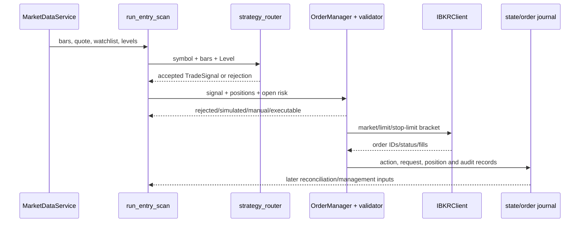
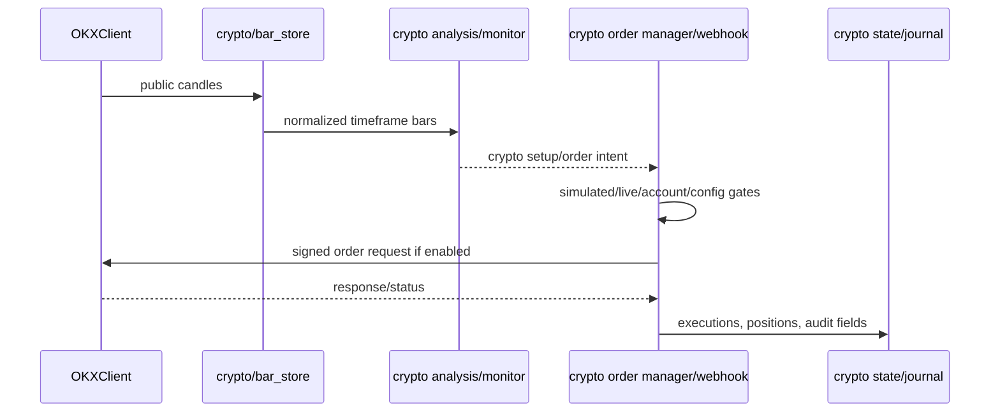
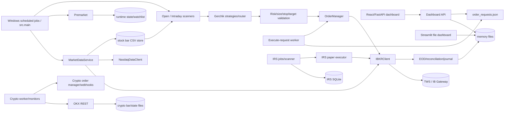
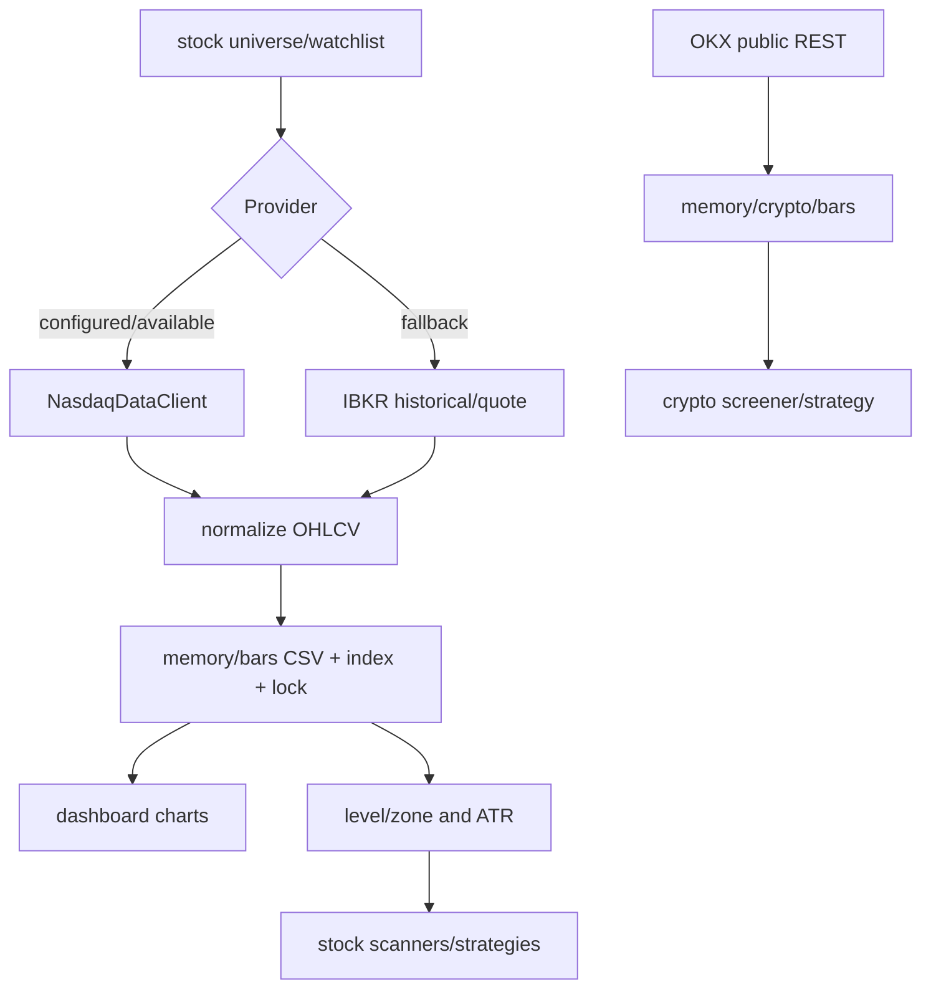
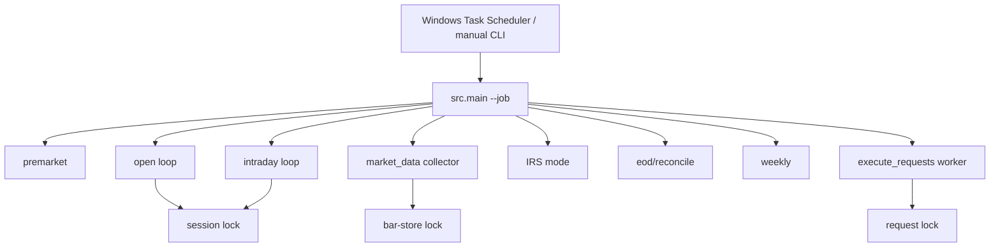
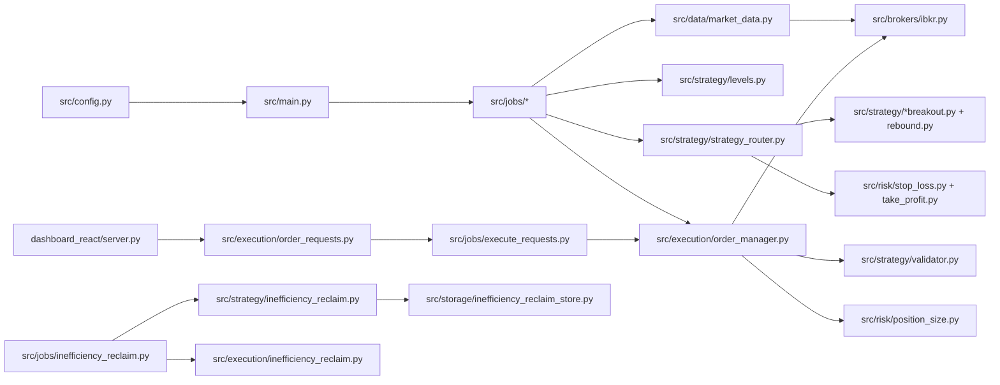
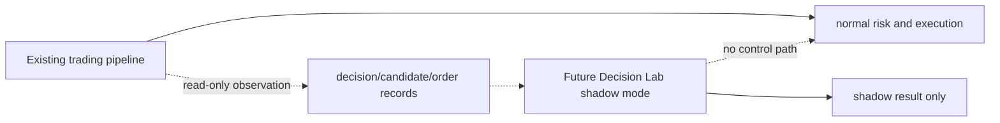

# Gerchik Trading Bot — Architecture Audit

Audit date: 2026-09-26  
Scope: repository inspection only. No trading worker was started, no broker or exchange write was attempted, no application code/configuration was changed, and no destructive dashboard action was activated.

Evidence labels used below: **[CODE CONFIRMED]**, **[TEST CONFIRMED]**, **[RUNTIME CONFIRMED]**, **[GRAPHIFY DOCUMENTED]**, **[INFERRED]**, and **[UNVERIFIED]**.

## 1. Executive Summary

**[CODE CONFIRMED]** The repository is a hybrid multi-process Python trading system, not a single web service. The principal stock path is `src/main.py` plus scheduled job modules, `src/data`, `src/strategy`, `src/risk`, `src/execution`, and `src/brokers/ibkr.py`. A separate crypto subsystem lives under `src/crypto`. There are two dashboards: the current React/FastAPI service in `dashboard_react/server.py` (documented/default port 8550) and an older Streamlit file-backed operations dashboard in `dashboard/app.py` (default port 8501).

**[CODE CONFIRMED]** The stock pipeline is approximately:

```text
IBKR/Nasdaq data
  → persisted CSV bars and runtime state
  → premarket levels/zones/watchlist
  → open/intraday entry scan
  → strategy detectors and strategy_router
  → stop/target/R:R enrichment
  → OrderManager position sizing and validate_trade
  → IBKRClient bracket orders
  → runtime state/order_requests/trade logs
  → reconciliation, position history, reports, dashboard
```

**[CODE CONFIRMED]** The regular stock strategies currently wired into `strategy_router.py` are rebound, confirmed breakout, one-bar false breakout, two-bar false breakout, complex false breakout, and false-breakout continuation. The separate Inefficiency Reclaim (IRS) subsystem is substantially more stateful and audit-oriented, uses immutable zones and a SQLite database, and is hard-configured to paper-only/fail-closed by its settings validation.

**[CODE CONFIRMED]** The regular stock execution boundary is not a single immutable service boundary. `OrderManager.execute_trade()` is the normal scanner path, `execute_manual_order()` is an explicit/manual path, `src/execution/order_requests.py` provides a file-backed dashboard queue, `InefficiencyReclaimPaperExecutor` is a separate IRS execution path, and the broker adapter exposes several public order-placement methods. The normal paths repeat important validation, but the architecture should not be described as “all possible orders pass through one central risk API.”

**[CODE CONFIRMED]** The main safety defaults are paper trading and dry-run configuration, required stops and targets, max daily loss, max positions, max open risk, minimum R:R, spread and position-value checks, news filters, duplicate-position checks, session windows, process locks, and IRS-specific paper/live guards. The repository also contains intentional operator actions and explicit `--execute`/dashboard queue flows; these are order-capable by design and were not invoked during this audit.

**[CODE CONFIRMED]** Crypto is not merely another stock strategy. It has its own OKX REST client, CSV bar store, worker, analysis/strategy monitors, TradingView webhooks, manual-order path, and state files under the crypto memory directory. The audit found no evidence that crypto signals are routed through the stock `TradeSignal` → IBKR `OrderManager` path.

**[CODE CONFIRMED]** A future read-only Decision Lab can observe several useful points without controlling execution: persisted `daily_decisions.json`, `order_requests.json`, IRS SQLite audit tables, runtime state, dashboard APIs, and post-scan result objects. The safest initial seam is downstream observation of accepted/rejected candidate and trade-plan records, with an independent read-only consumer. Direct insertion before execution would have a materially higher risk of changing trading behavior.

## 2. Graphify Project Knowledge

**[GRAPHIFY DOCUMENTED]** `graphify-out/graph.json` exists and was queried before the source scan. The current graph reported 3,683 nodes and surfaced `src/main.py`, `src/jobs/premarket.py`, `src/jobs/session_utils.py`, `src/data/market_data.py`, `src/brokers/ibkr.py`, `src/execution/order_manager.py`, `src/strategy/signal_models.py`, `src/risk/risk_manager.py`, IRS scanner/strategy/storage modules, dashboard modules, and crypto modules.

**[CODE CONFIRMED]** The graph was useful as a navigation accelerator, especially for finding `run_entry_scan`, `manage_positions`, `route_strategies`, `TradeSignal`, `MarketDataService`, and IRS components. These relationships were checked against the current files before being used as architectural conclusions.

**[GRAPHIFY DOCUMENTED — UNVERIFIED]** Graphify also contains nodes for `Trading Bot Dashboard/...` and `design_handoff/...` copies. Those are design/reference artifacts, not automatically the current runtime. The graph therefore mixes live source, tests, documentation, and duplicated handoff snapshots.

**[CODE CONFIRMED]** The graph’s current generated files and labels are dirty in the worktree and were not treated as source-of-truth. The repository’s own instruction says to run `graphify update .` after code modifications; this audit modified only this Markdown report, so no application-code graph update was required.

**Graphify reliability assessment:** accurate for locating major modules and symbol relationships; incomplete or potentially stale for runtime ownership, duplicated dashboard artifacts, current dirty working-tree behavior, credentials/runtime state, and whether a discovered path is actually enabled. The source hierarchy used here was implementation code, then tests, then configuration/runtime evidence, then Graphify, then documentation, then inference.

## 3. Repository Structure

```text
src/
  main.py, config.py, scheduler.py
  brokers/              IBKR adapter
  data/                 market data, bars, chart history, news
  strategy/             levels, ATR, Gerchik detectors, router, decision log
  risk/                 stop, target, sizing, portfolio risk, kill switch
  execution/            stock order manager, request queue, IRS executor
  jobs/                 premarket, open, intraday, EOD, weekly, collectors, IRS
  crypto/               OKX client, crypto bars, worker, monitors, webhooks
  journal/              broker reconciliation, Flex, order journal, positions
  reports/              intraday and levels reports
  storage/              IRS SQLite store
dashboard/               legacy Streamlit file-backed dashboard
dashboard_react/         FastAPI server plus static React client
migrations/              IRS SQLite schema migration
config/                  stock and crypto universes
memory/                  runtime state, logs, bars, queues, reports, crypto state
strategies/              Pine/Python research and strategy artifacts
tests/                   unit/integration-style tests and IRS fixtures
scripts/                 onboarding, reconciliation, scheduled-task setup
run_*.cmd, *.ps1         Windows launch and operations wrappers
graphify-out/            generated Graphify graph/report artifacts
design_handoff/, Trading Bot Dashboard/
                          design/reference snapshots; not assumed runtime
```

**[CODE CONFIRMED]** The repository contains Python application code, CSV/JSON/Markdown persistence, one IRS SQLite subsystem, Windows Task Scheduler wrappers, and no evidence of a message broker or general-purpose service mesh. `node_modules`, build output, and generated caches were excluded from the architectural tree.

## 4. Runtime Architecture

| Component | Entry point / command | Responsibility | Communication/state |
|---|---|---|---|
| Stock job runner | `python -m src.main --job ...` | Dispatches premarket, open, intraday, market data, IRS, EOD, weekly, validation, request execution, and manual-watch jobs | Direct in-process calls; files under `memory/`; IBKR socket |
| Premarket | `src/jobs/premarket.py`, `run_premarket_task.cmd` | Fetches history, computes levels/zones/context, builds watchlist | Runtime state, research/levels reports |
| Open/intraday | `src/jobs/open.py`, `src/jobs/intraday.py` | Repeated scan ticks, new-entry validation, position management | IBKR, state, decision log, order manager |
| Market-data collector | `src/jobs/market_data_collector.py` | Refreshes saved stock bars during configured session | CSV bars and bar index |
| Execute worker | `src/jobs/execute_requests.py` | Claims dashboard-generated stock requests and calls `OrderManager` | `memory/order_requests.json`, heartbeat |
| IRS jobs | `src/jobs/inefficiency_reclaim.py`, scheduler entries | Hydration, setup/confirmation scans, EOD reporting | CSV history plus `memory/inefficiency_reclaim.db` |
| Crypto worker | `src/crypto/worker.py` and `src/crypto/main.py` | Collects/analyses OKX data and runs crypto monitors | OKX REST, crypto CSV/state files |
| React/FastAPI dashboard | `dashboard_react/server.py`, `run_react_dashboard.cmd` | Operational UI/API, watchlist, screeners, IRS, positions, reports | HTTP JSON APIs; may queue operator requests |
| Streamlit dashboard | `dashboard/app.py`, `run_dashboard.cmd` | Legacy read-only viewer over memory files | Direct file reads; documented as no IBKR connection |
| Alerts | `src/alerts/slack.py`, `src/slack_commands.py` | Notifications/operator commands where configured | HTTP webhook and local state |

**[CODE CONFIRMED]** The architecture is multi-process, schedule-driven and polling-driven, with file-based inter-process coordination. It is best classified as a modular monolith plus independent workers, not microservices or a general event-driven platform.

**[UNVERIFIED]** The exact currently registered Windows Scheduled Tasks were not re-inspected in this read-only audit. `src/scheduler.py` and the install script define the intended commands and distinct client IDs; task registration and current enabled/disabled state remain runtime facts.

## 5. Frontend / Dashboard

The current React client navigation in `dashboard_react/index.html` includes Dashboard, Watchlist, Pre-Open, stock screener, crypto screener, Inefficiency Reclaim, Intraday, Strategy Stocks, Strategy Crypto, Crypto, Orders Journal, Forex/related monitors, Trades & Positions, Forecast, and Reports. The FastAPI routes in `dashboard_react/server.py` include `/api/meta`, `/api/services`, `/api/dashboard`, `/api/watchlist`, `/api/preopen`, `/api/bars/{symbol}/{timeframe}`, `/api/market-screener`, `/api/crypto/market-screener`, `/api/strategy`, `/api/crypto/strategy`, `/api/inefficiency-reclaim`, `/api/inefficiency-reclaim/active`, `/api/trades`, `/api/orders`, `/api/reports`, and system/watchlist settings routes.

| UI screen | Route/API | Main component | Data source / backend | Trading impact |
|---|---|---|---|---|
| Dashboard | React root; `/api/dashboard`, `/api/meta` | React dashboard; `api_dashboard` | Runtime state, decisions, reports, services | Primarily observational |
| Watchlist | React navigation; `/api/watchlist` | Watchlist view | Runtime state and onboarding endpoints | Add/remove can mutate watchlist and queue onboarding |
| Pre-Open | `/api/preopen`, `/api/preopen/{symbol}` | Pre-open view | State/watchlist, bars, levels, news fields | Display/inspection; premarket job itself changes state |
| Stock Screener | `/api/market-screener` | `market_screener.py` + React view | Saved bars/market screener calculations | Candidate display; possible forecast/manual request path |
| Crypto Screener | `/api/crypto/market-screener` | React view/server crypto calculations | OKX crypto bars and LP/PRB patterns | Display; separate crypto order paths exist |
| Inefficiency Reclaim | `/api/inefficiency-reclaim`, settings/active | IRS React view | IRS scanner, SQLite, persisted bars | Manual scan/settings; IRS executor is separately order-capable |
| Intraday | dashboard APIs/state | Intraday view | `daily_decisions.json`, reports, state | Displays attempted/accepted/skipped decisions |
| Strategy Stocks | `/api/strategy` | strategy monitor | Saved stock bars and strategy calculations | Monitor/display; verify any downstream request separately |
| Strategy Crypto | `/api/crypto/strategy` | crypto strategy monitor | OKX bars, BMSB/Gaussian monitor logic | Separate crypto monitor/order path |
| Crypto | crypto API routes | crypto trade-level view | OKX data/state | Separate from stock/IBKR path |
| Orders Journal | order/report APIs and local files | journal view | `order_requests.json`, closed positions, reports | Refresh is observational; close/order buttons are not |
| Trades & Positions | `/api/trades`, `/api/positions`-style APIs | trades view | runtime state plus broker reconciliation artifacts | “Close Position” queues a close request |
| Forecast | local React/legacy calculator | `dashboard/forecast.py`, `render_forecast` | watchlist, bars, scenario inputs, positions | Forecast is display/scenario logic; explicit Place/Close actions enqueue requests |
| Reports | report endpoints/files | report view | Markdown/Excel/JSON/report directories | Display/download |

The legacy Streamlit dashboard has the explicit pages Dashboard, Pre-Open, Intraday, Trades & Positions, Forecast, and Reports. It is documented as read-only, but its code contains explicit order/close request dialogs in the current dirty checkout; therefore the documentation and implementation should not be conflated.

The current FastAPI route inventory is more extensive than the navigation labels alone: `/api/orders-journal`, `/api/orders-journal/export`, `/api/orders-journal/review`, `/api/order/place`, `/api/order/close`, `/api/crypto/order/simulate`, `/api/crypto/order/place`, `/api/stocks/tradingview`, `/api/crypto/tradingview`, and `/api/forex/tradingview` are all present in `dashboard_react/server.py`. These routes are evidence of capability, not evidence that they are enabled or currently being used.

**[CODE CONFIRMED]** `Refresh` primarily reruns dashboard reads. `FETCH CANDLES` posts to `/api/system/fetch-ibkr-candles`, which starts/queues a one-shot market-data refresh process and can contact IBKR. `HARD RESET` posts to `/api/system/hard-reset` and launches `run_dashboard_hard_reset.cmd`, which closes/reopens dashboard services, market-data collector, execute worker, and crypto worker; it is operationally destructive to process state and was not activated. Order and close buttons write request records and depend on the execute worker.

## 6. API & Internal Communication

**[CODE CONFIRMED]** The React dashboard uses REST-style FastAPI JSON endpoints. The legacy Streamlit dashboard calls local file-backed access functions. Stock workers communicate through direct Python calls and shared files; they do not use GraphQL. The audit found no project GraphQL layer. Graphify is unrelated to GraphQL.

Important paths:

```text
React browser → FastAPI server → data_access/state/bar stores
React browser → FastAPI POST → watchlist or order_requests.json
execute_requests worker → order_requests.json → OrderManager → IBKRClient
src.main → job module → MarketDataService/strategies/risk → OrderManager
intraday/open → session_utils.run_entry_scan → OrderManager
IRS job/API → IRS scanner/strategy/store → IRS paper executor where explicitly invoked
```

**[CODE CONFIRMED]** Locks are file-based: runtime job-loop locks, bar-store locks, daily-decision locks, order-request locks, and crypto worker locks. These provide coordination, but they are not an event bus and do not create transactional cross-file state.

## 7. Market Data Architecture

### Stocks

**[CODE CONFIRMED]** `MarketDataService` prefers `NasdaqDataClient` when configured and data is returned; it falls back to `IBKRClient.get_historical_bars`. IBKR supplies historical data, account/position state, quotes, news providers and historical news. The normalized bar schema is date/open/high/low/close/volume. Market session checks are implemented in `MarketDataService.market_is_open` and session utilities.

The stock path supports daily, weekly, 4-hour and intraday/5-minute-style bars. Premarket/open/intraday code uses the saved watchlist and fetched bars; the collector persists intraday bars. Exact real-time streaming/WebSocket quote ingestion was not found in the stock code; quote checks use IBKR requests and returned ticker values.

### Crypto

**[CODE CONFIRMED]** `OKXClient` uses HTTP REST with public market-data methods and signed private methods. `src/crypto/bar_store.py` persists normalized CSV bars under `memory/crypto/bars/` plus an index. Configured timeframes include `1Dutc`, 4H, 1H and 5m. The worker cadence defaults to five minutes. The code supports simulated trading by default through `OKX_SIMULATED_TRADING=true`, but the exact account permission and current live/demo runtime were not probed.

### Forex

**[CODE CONFIRMED]** The core IBKR adapter can create Forex contracts. Separate TradingView webhook state exists under `src/forex/tradingview_webhook.py`. A complete autonomous forex scanner/execution pipeline was not found.

## 8. Candle Architecture

**[CODE CONFIRMED]** Stock candles flow from provider/IBKR through `MarketDataService`, are normalized, and are persisted by `src/data/bar_store.py` as one CSV per symbol/timeframe plus `memory/bars/index.json`. Saves merge/deduplicate and use a lock plus temporary replacement. `chart_history.py` ensures required timeframes, derives weekly/daily data in fallback cases, checks minimum rows and stale completed-session dates, and records readiness/blocking details.

**[CODE CONFIRMED]** IRS hydration has its own multi-timeframe requirements and paced fetch/retry logic, but reuses the stock bar store. IRS required/optional histories are daily, 1H, 15m, with optional 5m/1m execution resolution.

**[CODE CONFIRMED]** Crypto uses an independent bar store and does not share the stock CSV namespace. There is no universal candle service or pub/sub stream that all screeners subscribe to. Screeners and strategies often load saved bars or request through their own service/helpers.

**[UNVERIFIED]** A live candle-update subscription was not found. The visible system is principally request/poll/persist based.

## 9. Watchlist

**[CODE CONFIRMED]** Stock symbols originate from `config/STOCK_SYMBOLS.csv`/configured symbol sources and runtime onboarding. `src/jobs/symbol_onboarding.py` fetches history, calculates levels/zones/context and merges a watchlist into `memory/runtime/state.json`. `premarket.py` also builds a current watchlist payload from the configured universe and writes workflow/state artifacts.

Watchlist entries are structured dictionaries containing symbol-specific prices, ATR/technical fields, levels/zones, news/macro context, chart-history readiness and trade-decision status. `session_utils` and `main.py` deliberately merge/preserve existing watchlist entries so partial jobs do not silently shrink the state.

**[CODE CONFIRMED]** The React API provides add/bulk-add/remove routes. Add routes can initiate onboarding and therefore market-data/state writes. Pre-Open consumes the watchlist; the audit did not find evidence that a premarket watchlist is itself an order request.

## 10. Pre-Open

**[CODE CONFIRMED]** `run_premarket()` fetches/loads history, computes daily/intraday levels and zones, obtains symbol and macro news risk, checks chart history, builds watchlist rows, writes state/workflow logs and exports a premarket levels report. The resulting decision is generally `HOLD` under macro block or `READY_FOR_OPEN_VALIDATION`; it is not a direct entry-submission path.

**[CODE CONFIRMED]** The premarket job is session/scheduler driven and uses configured trading hours. It performs analysis and watchlist preparation; the subsequent `open`/`intraday` jobs perform entry validation. A separate IRS premarket-context mode exists for IRS history/context and is analysis-only when historical anchor conditions do not satisfy live gates.

**[INFERRED]** The strongest explicit no-entry boundary is architectural sequencing: premarket calls analysis/watchlist functions and does not call the regular `OrderManager.execute_trade`. The full system still contains separate manual/IRS paths, so “no order can occur during premarket” should not be claimed globally without an additional runtime gate audit.

## 11. Stock Screener

**[CODE CONFIRMED]** The current React `/api/market-screener` path is implemented in `dashboard_react/market_screener.py` and server helpers. It analyzes persisted stock bars for LP/PRB-style patterns and presents candidates/levels. It is not identical to `src/strategy/strategy_router.py`; it is a dashboard-facing screener/monitor path.

**[CODE CONFIRMED]** The regular stock job path uses watchlist symbols, intraday bars and level objects. `session_utils.run_entry_scan()` obtains levels, runs `route_strategies()`, records signal details, and passes accepted signals to `OrderManager`. Candidate generation, strategy validation and execution are therefore separate functions, but there are dashboard screener calculations that are not automatically the same object graph.

**[UNVERIFIED]** A single canonical “Stock Screener candidate” model spanning the React screener and the regular entry scanner was not found. The stable cross-path object is `TradeSignal` only after strategy detection.

## 12. Crypto Screener

**[CODE CONFIRMED]** Crypto screening is exposed at `/api/crypto/market-screener` and uses OKX-persisted crypto bars. The implementation contains LP1/LP2/PRB1/PRB2-style pattern calculations and crypto-specific symbol/timeframe handling. It diverges from stocks in provider, storage, 24/7 session assumptions, symbol identifiers and order adapters.

**[CODE CONFIRMED]** Crypto strategy monitoring also exposes BMSB and Gaussian-style calculations in the React/server path and separate crypto modules. This is not evidence that the stock Gerchik router consumes the same signals.

## 13. Intraday Engine

**[CODE CONFIRMED]** `run_intraday()` is a repeated loop. It checks market-open/session state, loads watchlist/runtime state, collects intraday bars, reconciles broker positions/open orders, determines whether new entries are enabled, runs `run_entry_scan()` when enabled, calls `manage_positions()` continuously, persists tracked positions, writes scan reports and sleeps/aligned to the next scan boundary.

**[CODE CONFIRMED]** `run_open()` similarly loops across its open-entry window rather than being only a one-shot 09:36 scan. `session_utils.get_scan_interval()` determines cadence and `job_loop_lock()` prevents overlapping invocations. Outside the entry window, the intraday job can continue position management while suppressing new entries.

**[CODE CONFIRMED]** Market close, invalid session, missing watchlist, kill-switch reasons, broker disconnect/reconciliation problems and stale/insufficient data can block new entries. Exact cadence is configuration-derived and should be read from the current `.env`/settings for a live deployment.

## 14. Gerchik Strategy Engine

The central regular strategy engine is `src/strategy/strategy_router.py`.

| Strategy | Detector | Inputs / output | Current status |
|---|---|---|---|
| Rebound | `rebound.detect_rebound` | Intraday bars + level → `TradeSignal` | Enabled only if configured |
| Confirmed breakout | `breakout.detect_breakout` | Bars + level → `TradeSignal` | Enabled only if configured |
| One-bar false breakout | `false_breakout_one_bar.detect_false_breakout_one_bar` | Bars/level/news context | Enabled only if configured; decision records |
| Two-bar false breakout | `false_breakout_two_bar...` | Bars/level/news context | Enabled only if configured |
| Complex false breakout | `false_breakout_complex...` | Multi-bar level failure | Enabled only if configured |
| False-breakout continuation | `false_breakout_continuation...` | Continuation setup | Enabled only if configured |
| Third touch / trend helpers | `third_touch.py`, `trend.py` | Supporting/research logic | Not shown as router entries in current code |

**[CODE CONFIRMED]** The router applies stop normalization (`calculate_stop_loss`), selects a target reference including the next level where applicable, applies `calculate_take_profit`, computes R:R and risk/share, builds partial targets, and persists false-breakout decision records. It does not itself submit orders.

**[DOCUMENTED LOGIC vs CODE]** `README.md` describes rebound, breakout and false-breakout intent and a 3:1 minimum R:R. The code confirms the existence of those detector classes/functions and the 3.0 default, but exact conditions are detector-specific and configuration-dependent. Pine files and design documents are research/reference material, not proof of current runtime activation.

### Strategy-specific implementation details

| Strategy | Timeframe/input | Setup and confirmation | Entry / stop / target | ATR and R:R | Status evidence |
|---|---|---|---|---|---|
| Rebound | Current-session intraday bars, normally 5-minute bars, plus a `Level` | Price must approach a level from the opposite side; rejection wick must exceed body; next candle must confirm direction | Entry is confirmation close. Stop is beyond the level/zone and rejection/confirmation structure with a buffer. Target is the next valid level or a minimum-R fallback | Rejects when ATR is too small relative to risk or ATR travel is excessive; target must meet configured minimum R:R | `[CODE CONFIRMED]` `src/strategy/rebound.py::detect_rebound`, `_finalize_signal` |
| Confirmed breakout | Current-session intraday bars plus strong level | Level acts as support/resistance; breakout candle closes across the zone; next candle also confirms by directional close, retest hold/reject, or higher/lower close; overextended breakout is rejected | Entry is confirmation close. Stop is beyond breakout/confirmation structure and zone. Target is next level or configured fallback | Requires level strength, ATR room (`MIN_ATR_TO_RISK_MULTIPLE`), ATR travel check except clean new extreme, and minimum R:R | `[CODE CONFIRMED]` `src/strategy/breakout.py::detect_breakout`, `_finalize_signal` |
| One-bar false breakout | Intraday bars, level and optional news context | One candle pierces the level and closes back through/inside the zone with rejection confirmation | Detector supplies entry/technical stop; router normalizes stop and target; target uses valid next level or designated fallback | Detector/router apply ATR and R:R gates; false-breakout decisions are persisted | `[CODE CONFIRMED]` `src/strategy/false_breakout_one_bar.py` |
| Two-bar false breakout | Intraday bars, level and optional news context | First candle creates the apparent break; second candle recovers/closes back through the level before the signal is emitted | Detector supplies entry/stop; router applies common stop/target/R:R normalization | Strategy-specific ATR/level checks plus router minimum R:R | `[CODE CONFIRMED]` `src/strategy/false_breakout_two_bar.py` |
| Complex false breakout | Intraday multi-bar sequence, level and news context | Price remains beyond a level for a multi-candle sequence, fails to continue cleanly, then returns/ confirms through the level | Detector output is normalized by router | Router stop-distance, target and R:R checks; decision log captures router status | `[CODE CONFIRMED]` `src/strategy/false_breakout_complex.py` |
| False-breakout continuation | Intraday bars, level and news context | Continuation-specific failure/reclaim pattern; exact gate is implemented in the detector rather than a generic configuration object | Detector supplies signal fields; router owns final normalized stop/target/R:R | Detector and router gates; no separate universal position-size model | `[CODE CONFIRMED]` `src/strategy/false_breakout_continuation.py` |

The exact `enabled_strategies` list is configuration-driven. Therefore “implemented” and “active in this runtime” are intentionally separate claims.

## 15. Strategy Stocks

**[CODE CONFIRMED]** Regular stock strategy execution is not a separate “Strategy Stocks” service. The current architecture uses the entry scanner (`session_utils.run_entry_scan`) and `strategy_router.route_strategies` over levels/watchlist bars. The React Strategy Stocks view is a monitor/API presentation path.

Accepted `TradeSignal` objects are passed to the order manager, which can simulate/reject/execute depending on dry-run and validation. Thus the stock strategy path can affect execution, while the dashboard monitor alone is not evidence of execution.

## 16. Strategy Crypto

**[CODE CONFIRMED]** Crypto strategy monitoring is separate from stock strategy routing. Current code references BMSB and Gaussian monitor logic, OKX bars, crypto state and crypto-specific order/TradingView paths. The audit found no shared stock `RiskManager`/`TradeSignal` execution boundary for these signals.

**[UNVERIFIED]** The exact set of crypto strategies enabled in the current runtime and whether any worker is currently active were not probed; code and configuration support are the evidence boundary.

## 17. Inefficiency Reclaim

**[CODE CONFIRMED]** IRS is an isolated deterministic subsystem. `src/scanners/inefficiency_reclaim.py` produces scan results; `src/strategy/inefficiency_reclaim.py` models bars, levels, zones, setups, state, account/quote context, candidate/plan logic and confirmation; `src/storage/inefficiency_reclaim_store.py` persists audit state; `src/execution/inefficiency_reclaim.py` provides the paper executor; `src/jobs/inefficiency_reclaim.py` orchestrates modes.

The actual strategy is completed regular-session hourly displacement → immutable zone → controlled 15m retracement → deterministic confirmation → cost-aware stop-limit entry, technical stop, structural target, R multiple and risk-capped quantity. Filters include ATR/true range, body/close location, efficiency/overlap, relative volume, data freshness, spread, news/corporate-action/halt unknowns, session, account/buying power, existing position/order, score, target space and protective-stop capability.

**[CODE CONFIRMED]** Settings validation rejects non-paper IRS mode and rejects `ALLOW_LIVE_TRADING=true`. The connected analysis job does not automatically submit through the paper executor. IRS order capability exists only in explicit executor flow and is distinct from regular stock execution.

## 18. Forecast Engine

**[CODE CONFIRMED]** `dashboard/forecast.py` is deterministic scenario/replay/allocation logic over active/projected candidates, bars, levels, ATR-distance filters, equity/cash/daily P&L, spread, risk, max positions and current positions. It uses rules and technical data; no ML/LLM/external forecast provider was found.

**[CODE CONFIRMED]** Forecast results are stored in Streamlit session state or returned by API calculation; they are not the source of a scheduled trading decision. The screen explicitly describes itself as not changing live settings or connecting to IBKR. However, the UI’s “Place” and “Close” controls can enqueue separately reviewed order requests; that action is operator execution, not forecast inference.

## 19. Signal / Candidate / Trade Models

The principal regular cross-module intent model is:

```text
TradeSignal
  symbol, strategy, signal, direction
  entry, stop, target, level_price, level_type
  nearest_upper_level, nearest_lower_level
  reward_risk, risk_per_share, atr, atr_used
  confidence, level_strength, is_new_extreme
  partial_targets, notes, metadata
```

**[CODE CONFIRMED]** `TradeSignal` is a dataclass in `src/strategy/signal_models.py`. IRS has separate domain objects including `Bar`, `Quote`, `Level`/`StructuralLevel`, `StrategyContext`, `StrategyCandidate`, setup/state/order-plan concepts. Request records in `order_requests.py` carry symbol/action/setup fields, entry/stop/target, R:R, quantity and status metadata. Runtime positions are dictionaries in `state.json` and broker-derived lists.

**[UNVERIFIED]** There is no single regular-system `TradePlan`, `RiskDecision`, `OrderRequest`, `Fill`, and `Position` type covering all asset classes. Several are dictionaries/files or IRS-specific persistence records.

## 20. Decision Points

1. **Candidate detection:** each strategy detector returns a signal or `None`.
2. **Router acceptance/rejection:** `route_strategies()` rejects invalid stops/targets/R:R and returns accepted `TradeSignal` objects.
3. **Entry-scan validation:** `run_entry_scan()` applies session, data, ATR, quote, news, duplicate and related checks before calling the order manager.
4. **Risk validation:** `OrderManager.execute_trade()` sizes and calls `validate_trade()`; invalid results are rejected or recorded as manual candidates where quote subscription needs operator review.
5. **Execution mode:** dry-run simulates; otherwise the manager calls IBKR bracket placement. Manual and IRS paths have additional explicit gates.
6. **Position management:** `manage_positions()` and broker reconciliation decide whether protective/exit actions are needed.

**[CODE CONFIRMED]** Decisions are deterministic rules, thresholds, configuration, broker state, news state and user action. No LLM/AI decision provider is in the current regular stock execution path.

## 21. Entry / Stop / Target Calculation

**Entry:** detector-generated for normal strategies; explicit user input for `manual_watch`; IRS builds a stop-limit plan; dashboard forecast rows contain projected entries.

**Stop:** strategy detectors provide a technical stop; `strategy_router` calls `calculate_stop_loss`, which uses configured percentage/ATR floor and max-distance rules and rounds for direction. IRS has its own technical/cost-aware stop plan.

**Target:** router uses a strategy target or next appropriate level and calls `calculate_take_profit`; regular target requires configured minimum R:R, default 3.0, with fallback only for designated technical-stop strategies. Partial targets are built centrally in the regular risk module. IRS calculates structural/cost-adjusted target values in its domain.

**[CODE CONFIRMED]** This is duplicated across regular detector/router, dashboard forecast calculators, manual order normalization, and IRS. The duplication is a key future Decision Lab/source-of-truth concern.

## 22. Position Sizing

For the regular stock path, `src/risk/position_size.py` implements:

```text
risk_per_share = abs(entry - stop)
risk_budget = account_equity × risk_pct
shares = floor(risk_budget / risk_per_share)
```

Then `position_value_ok()` checks quantity ≥ 1, notional ≤ `MAX_POSITION_VALUE`, and optionally available cash. `OrderManager` enriches the signal with quantity and risk amount before validation. IRS uses its own configured percent-of-equity/fixed-cash caps and quantity logic. Crypto order sizing is adapter/monitor-specific and not unified with stock sizing.

## 23. Risk Management

| Risk control | Implemented | Location | Hard/soft | Applied when |
|---|---|---|---|---|
| Paper/dry-run mode | Yes | `config.py`, broker/execution paths | Hard safety gate | Order submission |
| Risk per trade | Yes | `position_size.py`, `validator.py` | Hard | Before regular order |
| Max daily loss | Yes | `RiskManager`, kill switch | Hard | Job/entry gate |
| Max open positions | Yes | validator/config | Hard | Before regular order |
| Max open risk | Yes | `RiskManager`, validator | Hard | Before regular order |
| Minimum R:R | Yes | `take_profit.py`, validator | Hard | Router/order validation |
| Stop/target required | Yes | validator/order manager | Hard | Before order |
| Max position value/cash | Yes | `position_size.py` | Hard | Sizing/validation |
| Spread/quote freshness | Yes | quote checks, IRS gates | Hard where reached | Entry/IRS |
| News/macro risk | Yes | `NewsRiskFilter`, validator | Hard block | Entry |
| ATR/level/room filters | Yes | strategy detectors, session utils | Hard/strategy-specific | Candidate/entry |
| Duplicate positions | Yes | validator, IRS executor | Hard | Entry |
| Market hours | Yes | market/session utilities | Hard | Entry |
| Kill switch on divergence/stop integrity | Yes | `kill_switch.py` | Hard | Intraday/job loop |
| Process overlap locks | Yes | `session_utils`, bar/request stores | Operational hard gate | Workers |
| Crypto caps/simulated mode | Yes in crypto paths | crypto config/manager | Path-specific | Crypto orders |

**Central-boundary answer:** **[CODE CONFIRMED] No single universal risk boundary covers every order-capable path.** The regular scanner path is well centralized through `OrderManager` + `validate_trade`; manual order, IRS paper executor, crypto order manager, TradingView webhooks and public broker methods are separate seams. The audit did not invoke any.

### Order-capable call-site inventory

The following code paths can reach an external order-write method, subject to their own safety gates:

| Path | Call site | Gate/behavior |
|---|---|---|
| Regular stock entry | `src/execution/order_manager.py::execute_trade` | Sizes and calls `validate_trade`, then submits market bracket |
| Dashboard/manual stock placement | `src/jobs/execute_requests.py::_process_place` | Rejects if `PAPER_TRADING` is false; calls `execute_manual_order`; deliberately bypasses autonomous spread/news/ATR/market-hours quality gates for an explicit reviewed setup |
| Dashboard close | `src/jobs/execute_requests.py::_process_close` | Resolves broker position and calls `broker.place_market_order` directly after paper/dry-run gate |
| Position manager / kill switch | `src/jobs/session_utils.py::manage_positions` | Can call `place_market_order` for eligible managed exits; protective-stop failure halts rather than auto-flattens |
| IRS | `src/execution/inefficiency_reclaim.py` | Paper-only executor calls stop-limit bracket adapter after repeated IRS gates |
| Broker adapter | `src/brokers/ibkr.py` | Public market, limit, stop, market-bracket, limit-bracket and stop-limit-bracket methods call `ib.placeOrder` |
| Crypto | `src/crypto/okx_client.py`, `src/crypto/tradingview_webhook.py`, crypto managers | Separate signed OKX market-order path and simulated-mode checks |

This inventory is why the report does not claim that every order must pass through the regular validator.

## 24. Stock Trade Lifecycle

**[CODE CONFIRMED]** Representative regular path:

```text
MarketDataService / saved bars
  → premarket watchlist and Level objects
  → session_utils.run_entry_scan
  → detector functions in src/strategy
  → strategy_router.route_strategies
  → TradeSignal with normalized stop/target/R:R
  → OrderManager.execute_trade
  → calculate_position_size + validate_trade
  → IBKRClient.place_*_bracket_order
  → broker order/fill state
  → state.json / order journal / logs / reconciliation
  → manage_positions / closed-position history / reports
```



## 25. Crypto Trade Lifecycle

**[CODE CONFIRMED]** Representative crypto path is separate:

```text
OKX public REST candles/quotes
  → crypto bar store
  → crypto analysis/screener or BMSB/Gaussian/TradingView signal
  → crypto order manager/manual/webhook path
  → OKX signed private REST call when enabled, or simulated state
  → crypto runtime state/journal/dashboard
```



**[UNVERIFIED]** Current exchange-side fills/positions were not queried during the audit.

## 26. IBKR Execution

**[CODE CONFIRMED]** `src/brokers/ibkr.py` uses `ib_insync`. It handles host/port/client ID, connection retry/reconnect, market-data type, stock and Forex contracts, account summary, positions, open orders, executions, quotes, historical bars, news, cancellation, order resizing and several order forms.

Implemented order forms found in code: market order, limit order, stop order, stop-limit parent, and bracket-style parent/protective-stop/target combinations. OCA linkage and order references are used in bracket/IRS flows. The adapter explicitly places parent and child orders with `ib.placeOrder` and awaits/inspects settlement status.

**[CODE CONFIRMED]** Partial fills, child resizing, broker statuses, reconnect/reconciliation and cancellation are handled in parts of the regular/IRS paths. The exact behavior varies by path; there is no claim here of atomic multi-order transactionality.

The concrete stock write surface in `src/brokers/ibkr.py` is: `place_market_order`, `place_market_bracket_order`, `place_limit_bracket_order`, `place_stop_limit_bracket_order`, `place_stop_order`, `place_limit_order`, `replace_stop_order`, and the underlying `ib.placeOrder` calls. `src/jobs/execute_requests.py` and `src/jobs/session_utils.py` also call market-order methods directly for explicit dashboard requests, closes, and position-management actions. These are important bypass/ownership facts for future integration work.

**[UNVERIFIED]** TWS vs Gateway mode, current account, active port, and broker-side live/paper state were not queried. Configuration defaults document `127.0.0.1:7497`, paper trading true, and retries.

## 27. Crypto Execution

**[CODE CONFIRMED]** `OKXClient` implements signed authentication support and public/private REST requests. `src/crypto/order_manager.py`, `manual_order.py`, and TradingView webhook modules provide separate order/state pathways. `OKX_SIMULATED_TRADING` defaults true and `OKX_ACCOUNT_MODE` defaults spot. The repository also contains crypto worker heartbeats/locks.

**[UNVERIFIED]** The current exchange mode, permissions, leverage/margin configuration, live order types, live fills, and rate-limit behavior were not tested. No crypto order was sent.

## 28. Position Management

**[CODE CONFIRMED]** `session_utils.manage_positions()` is called from the intraday loop. It receives broker positions/open orders, internal tracked positions, quotes and order manager dependencies. `sync_tracked_positions_with_broker()` reconciles local state with broker data. EOD and position-history modules archive/record positions.

Regular bracket orders supply protective stop and target children; partial-target metadata exists. IRS explicitly handles partial-fill child resizing, protection checks, reconnect discrepancies and expired unfilled brackets. Break-even/trailing/ATR-trailing/time-stop behavior was not found as one universal position-manager feature; any strategy-specific exit behavior must be treated separately.

## 29. Trades & Positions

**[CODE CONFIRMED]** The source of truth is composite: current broker positions/open orders/executions are authoritative for broker state when available; `memory/runtime/state.json` holds tracked runtime positions; `closed_positions.json` and `position_history.json` preserve local history; dashboard data access merges/display these records. Reconciliation code explicitly handles broker/local divergence and stores sync status.

P&L and closed-trade representations are assembled from journal/reconciliation records and reports. The UI’s manual close action is a request queue operation, not a direct broker API call from the browser.

## 30. Orders Journal

**[CODE CONFIRMED]** `src/journal/order_journal.py` reads stock request records, runtime state, closed positions, crypto TradingView state and forex/stock webhook states. `order_requests.json` records request IDs, action/type, setup fields including symbol/side/entry/stop/target/R:R/quantity, status, timestamps and result/error information as produced by the worker. IBKR IDs/status/fills are available through broker reconciliation and execution records.

**Answer to “can it reconstruct why?”** **Partially, not universally.** Normal strategy decisions are recorded in `daily_decisions.json` with detector/router context, and request/journal records can link setup values to an order. But the multiple paths, dictionary/file schema, separate crypto/IRS stores, manual requests and possible broker-side events mean a complete causal chain is not guaranteed for every trade without joining several records and handling missing fields.

## 31. Reports

**[CODE CONFIRMED]** Reports are generated from memory logs, intraday decision records, order/journal data and report files. `src/reports/intraday_report.py`, `levels_export.py`, EOD/weekly jobs and dashboard report readers provide performance/decision summaries. The dashboard supports date/type/ticker filtering and workbook/report downloads.

Metrics and exact aggregation fields vary by report. There is no evidence of a separate analytical warehouse or universally precomputed report service; much of the UI reads generated files on demand.

## 32. Forex

**[CODE CONFIRMED]** Forex support is partial. `IBKRClient.create_forex_contract()` exists, and `src/forex/tradingview_webhook.py` stores TradingView state. `main.py` symbol normalization/account logic recognizes FX pair components. A complete Forex screener, strategy, risk-normalized position manager and full dashboard execution pipeline were not found.

**Status:** partial/experimental or webhook/state-oriented; autonomous Forex functionality is **UNVERIFIED**.

## 33. Database / Persistence

| Data | Current persistence |
|---|---|
| Stock bars | CSV under `memory/bars/` + `index.json` |
| Crypto bars | CSV under `memory/crypto/bars/` + index |
| Runtime watchlist/positions | `memory/runtime/state.json` |
| Daily decisions | `memory/daily_decisions.json` |
| Order requests | `memory/order_requests.json` |
| Closed/position history | runtime JSON files |
| Human/research logs | Markdown under `memory/` |
| IRS scanner/setups/orders/fills/risk/news | SQLite `memory/inefficiency_reclaim.db` via migration/store |
| Reports | Markdown, JSON/CSV/Excel/report directories |
| Crypto state/executions | crypto memory JSON files |
| Service status | runtime heartbeat/status JSON/logs |

**[CODE CONFIRMED]** The IRS migration creates schema_migrations, scanner_runs, inefficiency_zones, strategy_setups, strategy_state_transitions, strategy_signals, strategy_rejections, order_plans, orders, fills, risk_snapshots and news_checks. The regular stock pipeline does not use a relational order database as its universal state store.

## 34. Caching

**[CODE CONFIRMED]** Stock/crypto bars are durable caches with merge/deduplication and index metadata. Dashboard file readers cache based on file modification/time signatures. Runtime state and daily decisions use locks/atomic replacements. Strategy indicator caches are not a universal shared cache; computations are often repeated from loaded frames.

**[UNVERIFIED]** Exact TTLs are path-specific and configuration-derived. No Redis or distributed cache was found.

## 35. Background Jobs / Schedulers

| Process | Trigger/frequency | Input/output | Trading impact |
|---|---|---|---|
| Premarket | Scheduled weekday pre-open | IBKR/history/universe → levels/watchlist | Prepares candidates; no normal direct order call |
| Open | Open window loop | watchlist/bars → accepted/rejected/executed actions | Can submit regular stock orders |
| Intraday | Repeated market-hours loop | bars/quotes/positions → entries and management | Can submit/manage stock orders |
| Market data collector | Session polling; manual fetch | watchlist → persisted bars | Indirect; data prerequisite |
| Execute requests | Worker/queue polling | order_requests → OrderManager result | Can submit operator-requested stock orders |
| IRS modes | premarket/hourly/15m/EOD scheduled | multi-timeframe bars → IRS audit/signal | Analysis by default; explicit paper executor path |
| EOD | After close | reconciliation/reports/Flex/local statement | Reconciliation/reporting; may cancel expired IRS brackets |
| Weekly | Weekly schedule | logs/results → weekly report | Reporting/review |
| Crypto worker | configured collection cadence | OKX → crypto bars/analysis/state | Crypto path-specific |

## 36. Event Architecture

**[CODE CONFIRMED]** There is no general internal event bus with canonical `CandidateCreated`/`RiskApproved`/`OrderFilled` event types. The system uses direct returns, callback-like broker trade objects, JSON state transitions, file queues, logs, Slack messages and IRS SQLite audit rows. This is a significant distinction from an event-sourced architecture.

Real equivalents include decision-log rows, order-request status changes, broker order/fill status, IRS strategy transitions, and worker heartbeats. Names should not be normalized into invented event names.

## 37. Failure Handling

| Failure | Observed behavior |
|---|---|
| IBKR connect failure | Retry/reconnect in adapter; job may fail/skip if unavailable |
| Market data empty/stale | Empty/readiness/blocking results; entry gates reject/skip |
| Bar-store conflict | Lock, retry/recover stale lock, atomic replacement |
| State JSON invalid | Fallback/default plus log-based recovery where available |
| Duplicate worker/job | File lock prevents overlap or returns blocked status |
| News unknown/high risk | Regular/IRS paths can block |
| Broker/local position mismatch | Reconcile; kill-switch logic can halt entries |
| Order rejected | Record status/reason; no invented fill |
| Partial fill | Broker/IRS paths inspect and resize protection where implemented |
| IRS reconnect/protection discrepancy | Fail closed/global entry lock and alert |
| Missing Flex/unmatched fill | Checkpoint remains unchanged; report for review; no guessed fill/order |
| Crypto API failure | Request error/worker state behavior is path-specific; live behavior unverified |

**[CODE CONFIRMED]** The stock/IRS design is generally fail-closed at explicit risk/data gates. Because there are multiple paths and direct adapters, fail-closed behavior should be verified per path rather than generalized to every possible webhook/manual integration.

One especially important distinction is the dashboard queue: ordinary reviewed setup requests use `OrderManager.execute_manual_order`, whose documented code path intentionally omits autonomous signal-quality gates such as spread, news, ATR and market-hours checks; market-only TradingView-style requests and closes call the broker market-order method directly. The worker still enforces paper mode and dry-run semantics, but this is a different safety contract from autonomous scanning.

## 38. Tests

**[TEST CONFIRMED]** Test files cover ATR, level detection/strength, breakout and false-breakout logic, rebound signals, strategy routing, stop/target/R:R, sizing, validator, news blocking, kill switch, market data, bar merging, chart history, premarket/intraday/session helpers, order flow, broker reconciliation, order journal, execution requests, IRS strategy/state/scanner/jobs/execution/backtest/fixtures, crypto manual orders/screener/strategy monitor, dashboard access/forecast/charts, and Flex/position history.

**[GAPS]** No test suite proves current external TWS/Gateway connectivity, current exchange permissions, end-to-end real broker fills, all webhook order paths through one risk boundary, concurrent production worker behavior under live timing, or current registered Windows task state. The audit did not run the test suite to preserve a strictly non-mutating inspection posture.

## 39. Graphify vs Current Code

**Confirmed accurate:** Graphify correctly exposes major source modules, calls and relationships around `main`, session jobs, market data, `TradeSignal`, strategy router, risk, IBKR, IRS and dashboards.

**Outdated or misleading:** Graphify includes copied design-handoff and older `Trading Bot Dashboard` files alongside current `dashboard` and `dashboard_react`. A graph node named Dashboard or a copied app path is not proof of the live process.

**Incomplete:** Graphify cannot establish current `.env` values, task scheduler state, worker liveness, broker/exchange account mode, or whether a configured strategy is enabled. It also does not replace tracing dictionary persistence across runtime files.

**Useful relationships:** strategy detector → router → risk functions → OrderManager → IBKRClient; IRS scanner → IRS strategy → store/executor; dashboard → request queue → execute worker; market data → bar store → session jobs. These are good future query/path anchors.

## 40. Architecture Diagrams

### Complete system architecture



### Market data flow



### Background jobs / scheduler flow



### Important module dependency map



## 41. BeeBots Architectural Comparison

The BeeBots comparison uses the referenced repository README as external architectural context. It describes OKX market snapshots, a decision provider, a plain-code risk layer, SQLite-before-action audit, paper-first defaults and dashboard streaming. It is a comparison only; no BeeBots code was copied or integrated.

| Architectural concept | Gerchik Bot today | BeeBots pattern | Structural gap |
|---|---|---|---|
| Market data | IBKR/Nasdaq stock path; separate OKX crypto path; durable CSV | OKX public data and in-process indicators | Gerchik has stronger asset separation but no universal market snapshot contract |
| Signal | Detector/router signals and IRS candidates | Strategy-style menu candidates | Gerchik signals are partly structured (`TradeSignal`) and partly dictionaries/domain objects |
| Decision | Deterministic router/validator and operator actions | Decision provider chooses from valid moves | No separate universal `SIGNAL != DECISION` abstraction |
| Risk | Regular validator, RiskManager, kill switch; separate IRS/crypto gates | Plain-code risk veto/shrink/force layer | Risk is path-specific rather than one universal boundary |
| Execution | IBKR adapter, IRS executor, OKX paths, request worker | Execution after decision/risk | Gerchik has multiple execution adapters and direct public broker methods |
| Audit | JSON/Markdown/CSV plus IRS SQLite | SQLite decision-before-action ledger | Regular audit is fragmented; IRS is closer to complete audit trail |
| Failure mode | Mostly fail-closed gates, path-dependent | AI down means hold/open nothing | Gerchik’s deterministic core is safer than an AI-dependent path, but cross-path uniformity is weaker |
| UI | REST/static React plus legacy Streamlit | live dashboard/event stream | Gerchik is file/API polling oriented; no universal event stream |

## 42. Candidate Integration Seams for Future Decision Lab

| Seam | Location/data | Read-only observation? | Execution risk | Shadow suitability |
|---|---|---|---|---|
| After detector generation | strategy detector returns `TradeSignal` | Requires in-process hook or replay/API exposure | Low if copied, but source changes needed | Good semantic signal seam |
| After router | `route_strategies()` accepted/rejected signals, normalized stop/target/R:R | Daily decision log already captures some router/detector context | Low if reading persisted log | Very good for regular strategies |
| After entry scan | `run_entry_scan()` result rows, signal details, skipped reasons | Result is available to job/report; persistence is partial | Low downstream | Best near-complete candidate seam |
| After risk/size | `OrderManager.execute_trade()` enriched signal, quantity, risk amount, validation result | Request/journal records expose much of this | Low if observer reads records | Best trade-plan/risk observation seam |
| Before execution | OrderManager immediately before `IBKRClient.place_*` | Requires new hook or instrumentation | High: can accidentally block/change timing | Not first-stage seam |
| After order submission | broker order IDs/status | `order_requests` and reconciliation expose fields | Low read-only | Useful execution audit seam |
| After fill/close | broker executions, closed positions, journal | Existing reconciliation/history | Low read-only | Good outcome seam |
| IRS store | scanner/setup/signal/risk/order/fill SQLite rows | Yes, direct read-only DB access | Low | Best IRS shadow seam |

**Safest initial Shadow Mode seam:** read accepted/rejected decisions and trade-plan/risk records after they are persisted or returned by the existing scan, with no callback into the pipeline. This preserves normal execution and makes Decision Lab’s ENTER/WAIT/REJECT an observation, not a control signal.



## 43. Single Source of Truth Analysis

| Information | Current source of truth | Duplicate calculations? |
|---|---|---|
| Symbol | Config/universe plus normalized runtime records | Yes across stock/crypto/FX formats |
| Market price | IBKR quote, saved bar close, OKX quote/bar | Yes; freshness differs |
| Candles | Stock/crypto CSV stores after provider fetch | Separate stores and derived timeframes |
| Level/zone | `Level` and premarket state; IRS immutable zone | Yes, dashboard/screener/IRS domains differ |
| Setup/signal | `TradeSignal`, detector returns, IRS setup/signal tables, crypto dicts | Yes |
| ATR | strategy/ATR helpers, dashboard calculations, IRS robust ATR | Yes |
| Entry | detector/manual/IRS/dashboard projected row | Yes |
| Stop | router risk helper, detector, IRS, manual path | Yes |
| Target | router take-profit/levels, forecast, IRS | Yes |
| R:R | `reward_risk_ratio`, forecast, IRS cost-adjusted R | Yes |
| Position size | regular `calculate_position_size`, IRS sizing, crypto sizing | Yes |
| Open order | broker open orders plus local request/order records | Yes; reconciliation needed |
| Fill | IBKR executions/Flex/local journal; OKX state | Multiple |
| Position | broker positions plus `state.json`/crypto state | Multiple |
| P&L | broker/reconciliation/reports/local records | Multiple |

The strongest actual source of truth is broker state for current IBKR orders/positions/fills when connected, durable bar stores for saved candles, and IRS SQLite for IRS audit entities. The regular system has no single canonical trade-plan database.

## 44. Architectural Risk Areas

1. **Multiple execution paths:** regular scanner, manual order, dashboard queue, IRS executor, crypto manager and webhook paths do not share one universal risk interface.
2. **Duplicate calculations:** entry/stop/target/R:R/size are recalculated in router, order manager, dashboard forecast, IRS and crypto modules.
3. **Split position state:** broker, `state.json`, closed-position files, order requests and crypto state can diverge and require reconciliation.
4. **File-based coordination:** locks and atomic replacements help, but multi-file updates are not one transaction.
5. **Stale/derived data:** dashboards and screeners can read saved bars while broker quotes have moved; freshness gates are path-specific.
6. **Graph contamination:** generated graph nodes include design copies and historical artifacts, which can mislead navigation unless source paths are checked.
7. **UI write capability:** despite read-only documentation for the legacy dashboard, current code includes queueing order/close actions and React has hard reset/fetch operations.
8. **Event absence:** no canonical event stream makes complete causal reconstruction and independent shadow observation harder.
9. **Runtime uncertainty:** current task registration, worker liveness, broker connection and exchange mode were not established by static audit.
10. **Partial Forex implementation:** contract/webhook support exists without an evident complete risk/execution lifecycle.
11. **Manual/operator paths:** explicit manual-watch and dashboard actions can bypass normal candidate provenance even when they still call risk checks.
12. **Broker order atomicity:** parent/child placement and reconnect/partial-fill behavior are path-specific; protective integrity must remain a hard gate.

## 45. Important Findings

1. **[CODE CONFIRMED]** The bot is a modular multi-process paper-trading system with scheduled jobs, file-backed coordination, IBKR stock execution and separate OKX crypto execution.
2. **[CODE CONFIRMED]** The open and intraday engines are continuous/aligned loops, not only a one-time open scan.
3. **[CODE CONFIRMED]** Premarket builds levels/zones/context/watchlist state and normally defers entry validation to open/intraday.
4. **[CODE CONFIRMED]** Regular Gerchik strategies are routed through `TradeSignal` and `strategy_router`, which normalizes stop, target, R:R and partial targets.
5. **[CODE CONFIRMED]** Rebound, confirmed breakout, one-bar/two-bar/complex false breakout and continuation detectors are wired candidates, subject to enabled-strategy configuration.
6. **[CODE CONFIRMED]** IRS is a separate deterministic, paper-only, fail-closed subsystem with immutable zones and SQLite audit tables.
7. **[CODE CONFIRMED]** Regular position sizing uses account equity × risk percentage divided by risk/share, then applies notional/cash limits.
8. **[CODE CONFIRMED]** Regular risk validation checks duplicate position, max positions, per-trade/open risk, stop/target, R:R, spread, market state, news and position value.
9. **[CODE CONFIRMED]** There is no universal risk boundary for every stock, IRS, crypto, webhook and manual path.
10. **[CODE CONFIRMED]** The main IBKR write operations are concentrated in `src/brokers/ibkr.py`, but multiple callers can reach its public placement methods through different managers.
11. **[CODE CONFIRMED]** Crypto uses a separate OKX REST/bar/state/order architecture and is not a stock-router extension.
12. **[CODE CONFIRMED]** Forecast is deterministic scenario/replay/allocation logic, not AI/ML forecasting and not an autonomous trading decision engine.
13. **[CODE CONFIRMED]** Current dashboard order/close controls enqueue requests; the execute worker consumes them through the regular order manager.
14. **[CODE CONFIRMED]** Broker/local positions and fills are reconciled through dedicated journal/history/Flex modules, but regular audit information is fragmented.
15. **[CODE CONFIRMED]** The existing daily decision log, order queue, IRS database and dashboard APIs provide substantial read-only material for a future Shadow Mode.
16. **[INFERRED]** A downstream observer of persisted accepted/rejected trade-plan/risk records is safer than inserting a Decision Lab into the pre-execution call chain.

### Direct answers to the final audit questions

1. **Processes:** scheduled/manual `src.main` jobs, open/intraday loops, market-data collector, execute-request worker, IRS jobs, crypto worker, React/FastAPI dashboard, and legacy Streamlit dashboard.
2. **Market-data entry:** Nasdaq Data Link/cloud when configured, IBKR historical/quote/news APIs for stocks, and OKX public REST for crypto.
3. **Levels/zones:** stock premarket and `src/strategy/levels.py` produce level/zone context; IRS creates immutable displacement zones in its own strategy subsystem.
4. **Pre-Open:** `run_premarket()` fetches history, computes levels/news/chart readiness, writes watchlist/state/reports, and normally returns HOLD or READY_FOR_OPEN_VALIDATION rather than placing a regular order.
5. **Stock Screener:** dashboard-facing LP/PRB screener plus the regular watchlist/level entry scanner; there is no one universal screener candidate model.
6. **Crypto Screener:** OKX-backed LP1/LP2/PRB1/PRB2 calculations through crypto-specific bars and dashboard routes.
7. **Intraday:** repeated session-aware loop with 5-minute/10-minute/15-minute/10-minute configured cadence bands, new-entry scan until the no-new-entry cutoff, and continued position management.
8. **Gerchik strategies:** rebound, confirmed breakout, one-/two-/complex false breakout, and false-breakout continuation are wired detectors; activation is configuration-dependent.
9. **Entry/stop/target:** detector and manual/IRS paths create initial values; router/risk/IRS/dashboard paths normalize or recalculate them.
10. **ATR:** regular `atr.py`, detector ATR room/travel checks, watchlist fields, dashboard calculations and IRS robust ATR.
11. **R:R:** `src/risk/take_profit.py::reward_risk_ratio`, detector/router gates, validator, dashboard forecast and IRS cost-adjusted plan.
12. **Position size:** regular `src/risk/position_size.py`; separate IRS and crypto calculations also exist.
13. **Pre-execution risk:** regular validator/order manager, session/news/quote/ATR gates, kill switch, IRS gates, crypto-specific gates, and dashboard worker paper/dry-run gates.
14. **Risk bypass:** yes, structurally; manual/dashboard market-only/close, IRS, crypto and webhook paths do not share one universal validator.
15. **IBKR order writers:** underlying `ib.placeOrder` calls are in `src/brokers/ibkr.py`; callers include regular `OrderManager`, IRS executor, execute worker, and session position management.
16. **Crypto order writers:** `OKXClient.place_market_order` and crypto TradingView/manual/order-manager paths.
17. **Fills:** broker trade/execution queries, order results, reconciliation, Flex/local report recovery, IRS fill tables and crypto state; completeness varies by path.
18. **Positions:** broker positions are reconciled into runtime tracked positions; closed/history files and crypto state provide local records.
19. **Orders Journal:** request/setup/order IDs/status/fill/reason fields are distributed across JSON, Markdown, reconciliation, report and IRS stores.
20. **Trades & Positions source:** broker state when available plus local runtime state/history; not one database.
21. **Forecast:** deterministic scenario/replay/allocation calculator; not ML/LLM and not autonomous execution.
22. **Forex:** partial contract/webhook/API support; no complete autonomous Forex lifecycle was confirmed.
23. **Persisted data:** bars, state, decisions, order requests, logs, reports, position history, crypto state and IRS SQLite audit entities.
24. **Memory-only/ephemeral data:** in-process pandas frames, detector candidates, loop results, broker trade objects, dashboard session-state forecast results and transient queue/worker values.
25. **Background jobs:** premarket, open, intraday, market data, IRS modes, execute requests, EOD, weekly, crypto worker and dashboard-triggered refreshes.
26. **IBKR disconnect:** reconnect retries where possible; failed/stale paths block or skip; reconciliation and IRS protection discrepancies fail closed.
27. **Stale data:** chart-history/bar readiness and quote freshness checks block relevant entries; behavior is path-specific.
28. **Graphify accuracy:** major module relationships are useful; copied design artifacts and runtime/configuration uncertainty make it incomplete for current operation.
29. **Graphify stale/incomplete areas:** duplicated dashboard snapshots, enabled state, worker/task state, credentials, broker/exchange mode and cross-file persistence semantics.
30. **Read-only Decision Lab observation:** decision log, entry-scan/report outputs, order queue, dashboard APIs and IRS SQLite are available seams.
31. **New service necessity:** initially not proven necessary; existing APIs/files/database can expose much of the required shadow data, though completeness depends on the desired provenance.
32. **Safest seam:** downstream observation after accepted/rejected candidate and risk/trade-plan records, with a write-only shadow result and no execution callback.

## 46. Unknowns / Items Requiring Verification

- Current Windows Task Scheduler registration, enabled state, triggers, duplicate-instance policy and running PIDs.
- Current `.env` values, broker account identity, TWS/Gateway connectivity and actual paper/live socket state.
- Whether any configured regular strategy is enabled in the current runtime, rather than merely implemented.
- Exact current worker liveness and whether crypto/execute/collector services are active.
- Current OKX demo/simulated/live mode, permissions, leverage and fills.
- Exact end-to-end behavior of every TradingView stock/crypto/forex webhook path under current configuration.
- Complete partial-fill behavior for every regular IBKR bracket variant, not only IRS-specific tested paths.
- Whether all dashboard/API routes described by the static React client are served by the current dirty server revision.
- Exact report aggregation formulas for every P&L/R metric and whether all trades are reconstructible across files.
- Whether any external process consumes or mutates runtime files outside this repository.
- Current Graphify freshness relative to the dirty source tree; the graph is useful but not a runtime authority.
- No live trade, broker fill, exchange fill, or production scheduler claim was validated during this audit.
